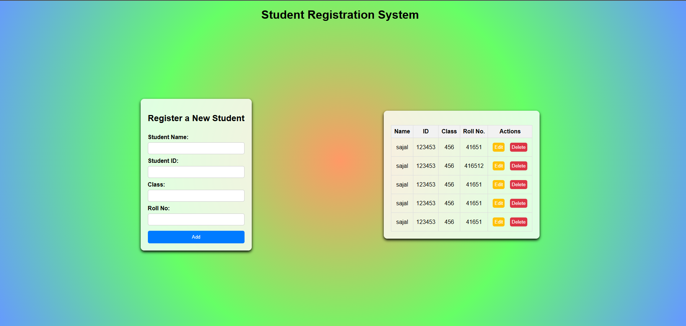

## Hey 👋, I'm [Sajal Debnath]
 
Github Repo : https://github.com/Sajal4/DOM-JS-Assignment.git
 
 

This is the repesntation How the project Look like
  

 
### Project Overview
The project is a simple web application that allows users to create and manage their Student Registrity System. The application will have the following features: 
 
● Implement functionality to add new student records.
 
● Allow users to edit existing records.
 
● Provide options for deleting records.
 
● After refreshing the page data should not disappear 
 
● Validate input fields to ensure student ID and contact number accept only numbers,
student name accepts only characters, and email accepts only valid email addresses.
 
● Make sure the user can't add the empty row.
 
● Add a vertical scrollbar dynamically

